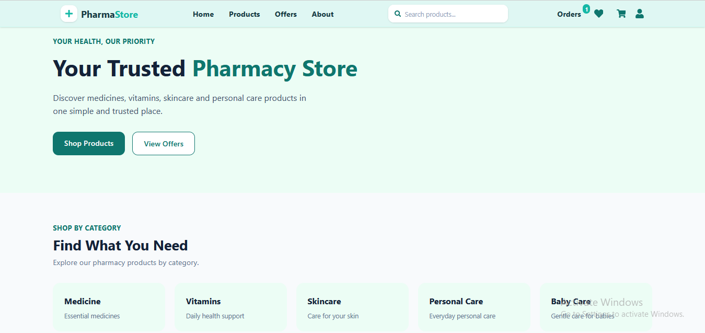
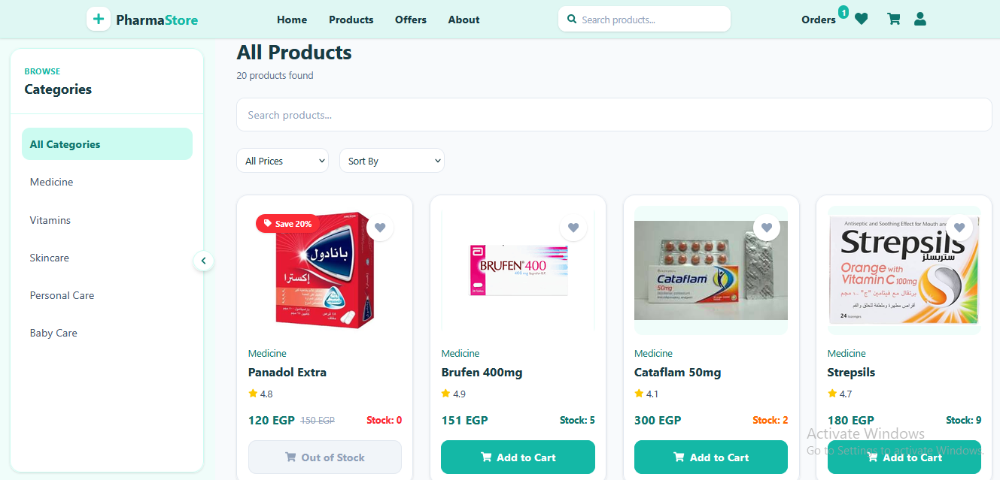
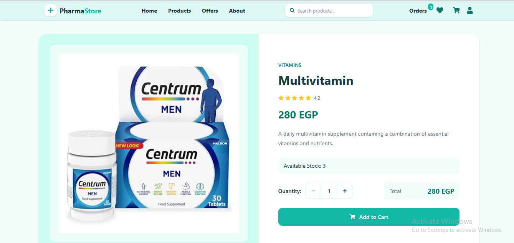
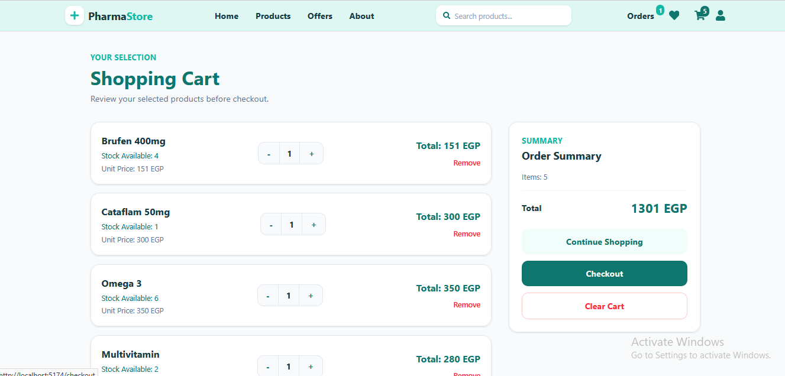
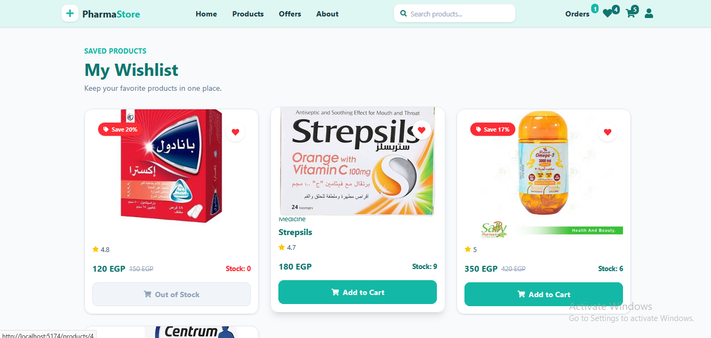
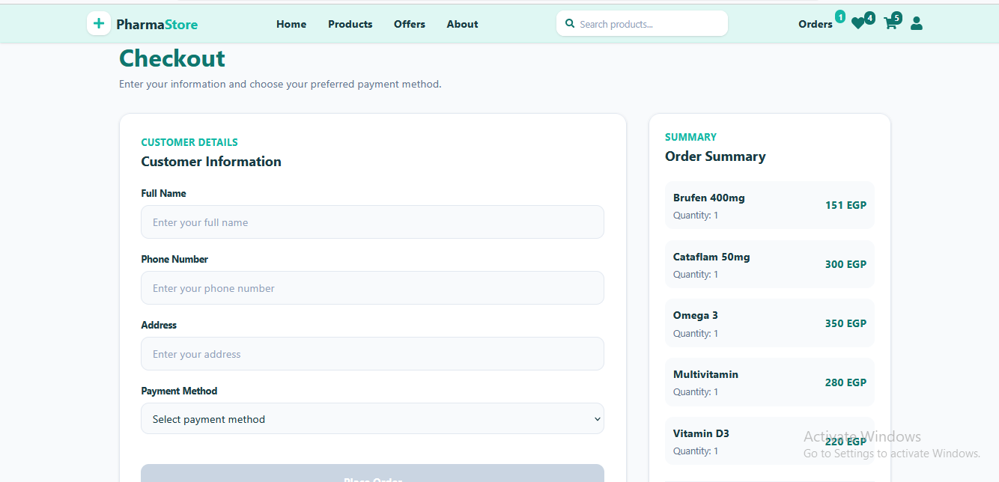

# 💊 Pharma Store

A modern pharmacy e-commerce frontend built with **React.js** and **Tailwind CSS**.

Pharma Store provides a simple and user-friendly shopping experience for browsing pharmacy products, searching and filtering products, managing a shopping cart and wishlist, and placing orders.

## 🚀 Features

* 🔎 Product search
* 🗂️ Product categories and filtering
* 💰 Price filtering and sorting
* 🛒 Shopping cart
* ❤️ Wishlist
* 📦 Order management
* 💳 Checkout and payment method selection
* 📱 Responsive user interface
* 💾 Data persistence using Local Storage
* ⚡ Client-side routing with React Router

## 🛠️ Technologies

* **React.js**
* **JavaScript (ES6+)**
* **Tailwind CSS**
* **React Router**
* **React Icons**
* **Vite**
* **Local Storage**
* **Git & GitHub**

## 📂 Project Structure

```text
src/
├── components/
├── context/
├── pages/
├── data/
├── App.jsx
└── main.jsx
```

## ⚙️ Getting Started

### 1. Clone the repository

```bash
git clone https://github.com/soodyaboalkher-debug/pharma-store.git
```

### 2. Navigate to the project

```bash
cd pharma-store
```

### 3. Install dependencies

```bash
npm install
```

### 4. Start the development server

```bash
npm run dev
```

Then open the local URL provided by Vite in your browser.

## 🎯 Project Goal

This project was built to practice and demonstrate practical frontend development skills using React.js, including reusable components, routing, state management, Local Storage, and building a complete e-commerce user experience.

## 👨‍💻 Developer

**Saudi Adel**

Frontend Developer focused on building clean, responsive, and user-friendly web applications with React.js and JavaScript.


## 📸 Screenshots

### 🏠 Home



### 💊 Products



### 📦 Product Details



### 🛒 Cart



### ❤️ Wishlist



### 💳 Checkout




